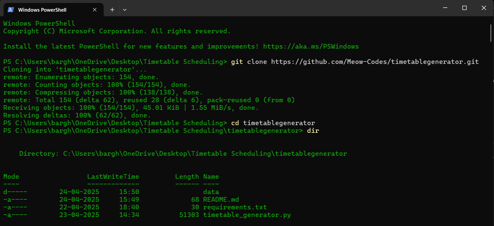
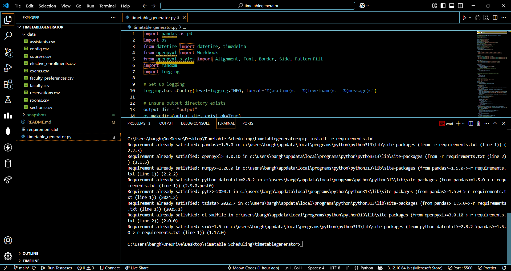
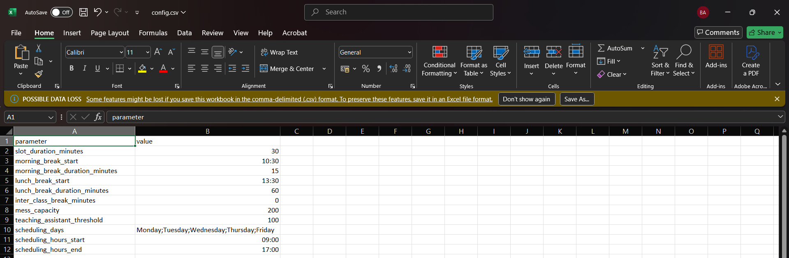
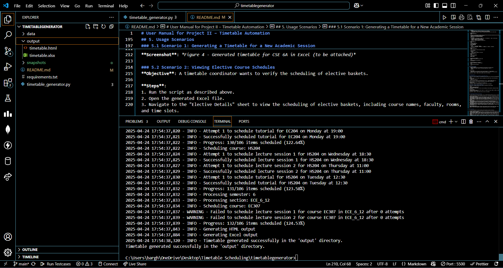
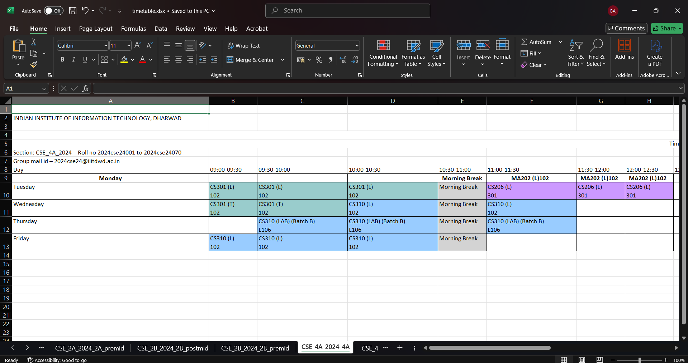

# User Manual for Project II – Timetable Automation

**By Team SupremeYaskin**

This user manual provides comprehensive guidance on downloading, setting up, configuring, and using the Timetable Automation software. It also outlines usage scenarios, satisfied requirements, planned future enhancements, and frequently asked questions (FAQs).

---

## 1. Overview

The Timetable Automation software automates the scheduling of courses for academic sessions at the Indian Institute of Information Technology, Dharwad. It is designed for stakeholders such as timetable coordinators, faculty, students, HoD, and Dean Academics. The software reads course data and configuration parameters from CSV files, schedules courses while avoiding conflicts, and generates timetables in Excel format.

---

## 2. Downloading the Software

The software is hosted on GitHub. Follow these steps to download it:

### 2.1 Prerequisites

- **Git**: Ensure Git is installed on your system. Download it from [git-scm.com](https://git-scm.com/downloads) if needed.
- **Python 3.8+**: Required to run the software. Download from [python.org](https://www.python.org/downloads/).
- **Visual Studio Code (VS Code)**: Recommended for editing and running the code. Download from [code.visualstudio.com](https://code.visualstudio.com/).

### 2.2 Steps to Clone the Repository

1. **Create a Folder**:
   - Create a new folder on your desktop (e.g., `TimetableAutomation`) or any preferred location.
2. **Open Terminal**:

   - Right-click inside the folder and select "Open in Terminal" (Windows: "Git Bash Here", macOS/Linux: "Open Terminal").
   - Alternatively, open your terminal and navigate to the folder using:
     ```bash
     cd /path/to/your/folder
     ```

3. **Clone the Repository**:

   - Copy the repository URL: `https://github.com/Meow-Codes/timetablegenerator.git`
   - Run the following command in the terminal:
     ```bash
     git clone https://github.com/Meow-Codes/timetablegenerator.git
     ```
   - This will create a `timetablegenerator` folder inside your chosen directory.

4. **Navigate to the Project Directory**:

   - Change to the project directory:
     ```bash
     cd timetablegenerator
     ```

5. **Open in VS Code** (Optional):
   - If you have VS Code installed, open the project by typing:
     ```bash
     code .
     ```
   - If VS Code is not installed, install it from [code.visualstudio.com](https://code.visualstudio.com/) and retry.



---

## 3. Setting Up the Software

### 3.1 Install Required Python Libraries

1. **Open a Terminal in VS Code**:

   - In VS Code, go to `Terminal` > `New Terminal`.

2. **Install Dependencies**:
   - The project includes a `requirements.txt` file listing necessary libraries (`pandas`, `openpyxl`).
   - Run the following command to install them:
     ```bash
     pip install -r requirements.txt
     ```
   - Ensure your Python environment is activated if using a virtual environment.



### 3.2 Directory Structure

After cloning, the project directory should look like this:

```
timetablegenerator/
│
├── data/                     # Directory for input CSV files
│   ├── courses.csv
│   ├── config.csv
│   ├── rooms.csv
│   ├── sections.csv
│   ├── faculty.csv
│   ├── assistants.csv
│   ├── elective_enrollments.csv
├── output/                   # Directory for generated timetables (created after running the script)
├── timetable_generator.py     # Main script for timetable generation
├── requirements.txt          # List of Python dependencies
└── README.md                 # Project overview and setup instructions
```

---

## 4. Setting Up Configuration Files

The software relies on CSV files in the `data/` directory for configuration and course data. Below are the required files and their expected formats:

### 4.1 Configuration Files Overview

- **`config.csv`**:

  - Contains scheduling parameters.
  - Format:
    ```
    parameter,value
    slot_duration_minutes,30
    scheduling_days,Monday;Tuesday;Wednesday;Thursday;Friday
    teaching_assistant_threshold,100
    ```
  - **Fields**:
    - `slot_duration_minutes`: Duration of each time slot (e.g., 30 minutes).
    - `scheduling_days`: Days of the week for scheduling (semicolon-separated).
    - `teaching_assistant_threshold`: Threshold for assigning teaching assistants (not currently used).

- **`courses.csv`**:

  - Contains course details.
  - Format:
    ```
    course_id,course_code,department,semester,section_id,lecture_hours,tutorial_hours,practical_hours,self_study_hours,credits,enrollment,is_elective,basket_id,combined,faculty_ids
    1,CS601,CSE,6,1,3,1,0,0,4,60,False,,False,101
    2,AB101,CSE,6,1,3,1,2,0,5,30,True,B1,False,102
    ```
  - **Key Fields**:
    - `lecture_hours`, `tutorial_hours`, `practical_hours`, `self_study_hours`, `credits`: LTPSC structure.
    - `enrollment`: Number of registered students.
    - `is_elective`, `basket_id`: For elective courses.
    - `combined`: Indicates if sections are combined.
    - `faculty_ids`: Semicolon-separated list of faculty IDs.

- **`rooms.csv`**:

  - Contains room details.
  - Format:
    ```
    room_number,capacity,type
    C101,60,LECTURE_ROOM
    C104,40,COMPUTER_LAB
    ```
  - **Fields**:
    - `capacity`: Maximum number of students.
    - `type`: E.g., `LECTURE_ROOM`, `COMPUTER_LAB`, `HARDWARE_LAB`, `SEATER_120`, `SEATER_240`.

- **`sections.csv`**:

  - Contains section details.
  - Format:
    ```
    section_id,department,semester,batch_name,year,strength
    1,CSE,6,6A,2022,60
    ```
  - **Fields**:
    - `batch_name`: E.g., `6A`.
    - `strength`: Number of students in the section.

- **`faculty.csv`**:

  - Contains faculty details.
  - Format:
    ```
    faculty_id,faculty_name
    101,Prof. Smith
    102,Prof. Jones
    ```

- **`assistants.csv`** (Optional):

  - Contains assistant details (not currently used).
  - Format:
    ```
    assistant_id,assistant_name,department
    201,TA John,CSE
    ```

- **`elective_enrollments.csv`** (Optional):
  - Contains enrollment data for elective courses.
  - Format:
    ```
    course_id,section_id,enrollment
    2,1,30
    ```

### 4.2 Steps to Configure

1. **Prepare CSV Files**:

   - Ensure all required CSV files are populated with correct data as per the formats above.
   - Place them in the `data/` directory. If the directory doesn’t exist, create it:
     ```bash
     mkdir data
     ```

2. **Verify Data**:
   - Open each CSV file in a text editor or Excel to confirm the data is correctly formatted.
   - Ensure there are no missing values unless specified as optional (e.g., `basket_id` for non-electives).



---

## 5. Usage Scenarios

### 5.1 Scenario 1: Generating a Timetable for a New Academic Session

**Objective**: Generate a timetable for the December 2024 – April 2025 session for CSE, DSAI, and ECE departments.

**Steps**:

1. Ensure all CSV files in the `data/` directory are updated with the latest course, room, and faculty data.
2. Run the script:
   ```bash
   python timetable_generator.py
   ```
3. Check the `output/` directory for the generated Excel file (e.g., `timetable_20250424_143022.xlsx`).
4. Open the Excel file to view timetables for each section, elective details, and statistics.

**Expected Output**:

- Timetables for each section in timetable.html and timetable.xlsx.




---

## 6. Requirements Satisfied by Current Version

The software addresses the following requirements from the `Timetable_Requirements-CS301 SE course.xlsx` document:

- **REQ-02-Config (Mandatory)**: Reads configuration parameters (e.g., slot duration, scheduling days) and course data from CSV files in the `data/` directory.
- **REQ-03 (Mandatory)**: Schedules courses in rooms with sufficient capacity; splits students into batches for labs if needed.
- **REQ-04-CONFLICTS (Mandatory)**: Distributes course components (lectures, tutorials, practicals) over the week, avoiding multiple components on the same day unless it’s a lab following a lecture/tutorial.
- **REQ-05 (Mandatory)**: Schedules courses with the same code across departments separately using unique timetable keys.
- **REQ-06 (Mandatory)**: Adheres to LTPSC structure for scheduling (e.g., 3 slots for 1.5+ lecture hours, 4 slots for practicals).
- **REQ-07 (Mandatory)**: Groups elective courses into baskets and schedules them simultaneously, avoiding room, faculty, and student conflicts.
- **REQ-08 (Mandatory)**: Allocates lab sessions based on room capacity, creating batches as needed.
- **REQ-09-BREAKS (Desired)**: Includes morning breaks (10:30-11:00) and lunch breaks (staggered by department).
- **REQ-10-FACULTY (Mandatory)**: Avoids consecutive classes for instructors; indirectly enforces a 3-hour gap by limiting daily scheduling.
- **REQ-18-LUNCH (Mandatory)**: Staggers lunch breaks by department to avoid overcrowding (CSE: 13:00-14:30, DSAI: 13:15-14:45, ECE: 13:30-15:00).

**Unsatisfied Requirements**:

- REQ-01 (modifying existing timetables), REQ-11 (faculty preferences), REQ-12 (reserved slots), REQ-13 (Google Calendar integration), REQ-14 (Excel with different views), REQ-16 (Statistics sheet), REQ-15 (exam timetable), and REQ-17 (teaching/lab assistants) are not yet implemented.

---

## 7. Future Work

The following enhancements are planned to address unmet requirements and improve functionality:

- **Support for Modifying Existing Timetables (REQ-01)**: Add functionality to load an existing timetable, add/remove courses with minimal changes, and reschedule.
- **Faculty Preferences (REQ-11)**: Allow faculty to specify preferred days and times for their courses via a new CSV file.
- **Reserved Time Slots (REQ-12)**: Enable coordinators to reserve specific time slots that the software will avoid scheduling.
- **Google Calendar Integration (REQ-13)**: Integrate with Google Calendar API to export scheduled courses to faculty/student calendars.
- **Exam Timetable Scheduling (REQ-15)**: Develop a module to schedule exams, minimizing days and arranging seating in multiple classrooms.
- **Teaching/Lab Assistants (REQ-17)**: Allocate teaching assistants for courses with enrollment > 100 and lab assistants for practical sessions.
- **Enhanced Analytics (REQ-16)**: Add reports for instructor effort (e.g., teaching hours) and student effort (e.g., class hours per day).
- **User Interface**: Develop a graphical interface for easier configuration and timetable viewing.

---

## 8. Frequently Asked Questions (FAQs)

**Q1: What should I do if the script fails to run?**

- **A**: Ensure all CSV files are correctly formatted and placed in the `data/` directory. Check the terminal for error messages, which may indicate missing libraries (re-run `pip install -r requirements.txt`) or invalid data (e.g., missing columns in CSV files).

**Q2: Can I change the slot duration or scheduling days?**

- **A**: Yes, edit the `config.csv` file in the `data/` directory. Modify `slot_duration_minutes` to change the slot duration (e.g., from 30 to 45 minutes) and `scheduling_days` to adjust the days (e.g., `Monday;Tuesday;Wednesday`).

**Q3: How are conflicts handled?**

- **A**: The software avoids room, faculty, and student conflicts by:
  - Checking room availability before scheduling.
  - Ensuring faculty are not scheduled for multiple classes at the same time.
  - Scheduling elective baskets simultaneously to avoid student conflicts.

**Q4: What if a room is not available for a course?**

- **A**: The software logs a warning and attempts to find another room or slot. If no room is available, the course may not be scheduled, and you’ll see a warning in the logs. Consider adding more rooms to `rooms.csv` or adjusting the schedule.

**Q5: How can I view the timetable for a specific section?**

- **A**: Open the generated Excel file in the `output/` directory. Each sheet is named by section (e.g., `CSE_6_1` for CSE 6A). The "Elective Details" sheet provides additional information for elective courses.

**Q6: Can I schedule courses for a new department like DASD?**

- **A**: Yes, add the department to your CSV files (e.g., `courses.csv`, `sections.csv`). The software will automatically recognize and schedule courses for the new department, though you may need to define lunch break timings for it in the script.

---

## 9. Contact Information

For support or inquiries, contact Team SupremeYaskin via the GitHub repository:

- **Repository**: [https://github.com/Meow-Codes/timetablegenerator](https://github.com/Meow-Codes/timetablegenerator)
- **Issues**: Submit issues on GitHub for bug reports or feature requests.

Team SupremeYaskin:

- Alakanti Karthik - 23bcs009
- B Vinayaka - 23bcs025
- B Rohan - 23bcs026
- Barghav Abhilash B R - 23bcs028

---
